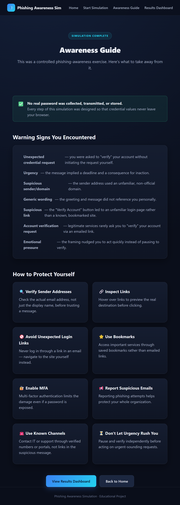

# Phishing Awareness Project Report

## 1. Introduction
The purpose of this project is to simulate a realistic phishing attack in a safe, controlled environment to assess user susceptibility and provide immediate educational feedback. Phishing remains one of the primary vectors for initial access in cyberattacks. By demonstrating the mechanics of a credential harvesting campaign, this project aims to raise security awareness and train participants to identify common warning signs—such as unexpected urgency and suspicious sender domains—ultimately strengthening the organization's overall security posture.

## 2. Methodology
The simulation was designed as a self-contained web application to ensure zero risk of actual data exposure. The environment consists of three main components designed to mimic a real-world attack chain:

1. **Simulated Inbox & Payload:** A mock email interface was created to present the user with a fabricated "Action Required: Account Security Verification" email. This email utilized common social engineering tactics, including an artificial sense of urgency, generic greetings, and a spoofed sender address.
2. **Credential Harvesting Portal (Mock):** A realistic-looking login page ("Northstar Account Portal") was developed to capture user interactions. Crucially, this page was designed for simulation purposes only; it intercepts form submissions to record the *attempt* but intentionally discards any entered password data, ensuring no actual credentials are ever transmitted or stored securely.
3. **Analytics Dashboard:** A backend server and local database were implemented to track user interactions anonymously. Metrics collected include emails viewed, links clicked, login attempts made, and successful reports of the phishing attempt.

### Simulated Inbox & Email

### Fake Login Page

## 3. Results
The simulation yielded valuable data regarding user interaction with suspicious emails. As shown in the statistics dashboard below, the system tracked the progression from initial email views to the more critical actions of clicking the embedded link and attempting a login. While a portion of users correctly identified the email as suspicious and utilized the "Report Phishing" feature, the data highlights that a significant number of participants still proceeded to the fake login portal. This indicates that the combination of simulated urgency and a familiar-looking landing page remains highly effective at bypassing initial user skepticism.

### Simulation Statistics Dashboard

## 4. Lessons Learned
The primary takeaway from this exercise is that technical controls alone are insufficient; human behavior remains the most unpredictable variable in cybersecurity. Key observations include:

*   **Urgency Overrides Caution:** The artificial deadline imposed in the email successfully pressured some users into acting quickly rather than pausing to verify the request independently.
*   **Domain Blindness:** Many users focused on the trusted display name ("IT Support") rather than scrutinizing the actual sender address domain or the URL of the login page.
*   **Value of Immediate Feedback:** The "Awareness Guide" presented immediately after a user interacted with the simulation proved to be a highly effective teaching moment. It explained the specific warning signs they had missed while the context was still fresh.

### Awareness Guide / Educational Output

## 5. Preventive Measures
To mitigate the risks highlighted by this simulation, the following strategies should be implemented:

1.  **Continuous Awareness Training:** Conduct regular, varied phishing simulations to keep security top-of-mind and train users to recognize evolving social engineering tactics.
2.  **Verify Sender Domains:** Encourage a culture where users are taught to always inspect the actual email address, not just the display name, especially for external senders.
3.  **Implement Multi-Factor Authentication (MFA):** Enforce MFA across all critical systems to ensure that even if a password is compromised via a phishing attack, the attacker cannot easily gain access.
4.  **Promote a "Reporting" Culture:** Ensure the process for reporting suspicious emails is frictionless and that users receive positive reinforcement for doing so.
